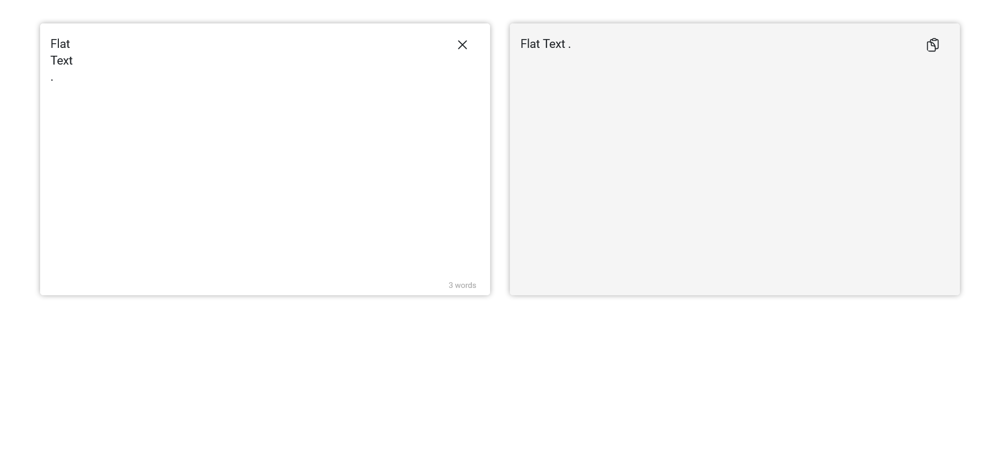

# Flat-Text

Flat text is a web application that allow you to remove new line character from a text and get a cleaned text. You can access the the app [here](https://mostafakhanali.github.io/flat-text/).

This app doesn't use any online services and your data is processed locally in your device.

## How to use Flat-Text

You can go to the [app](https://mostafakhanali.github.io/flat-text/) and paste your text at the input area, then you can copy the new text (with no new line) by clicking on the copy button.
